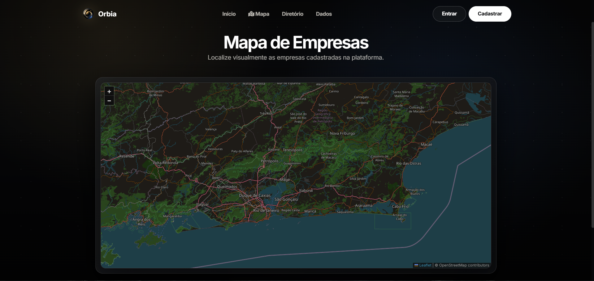
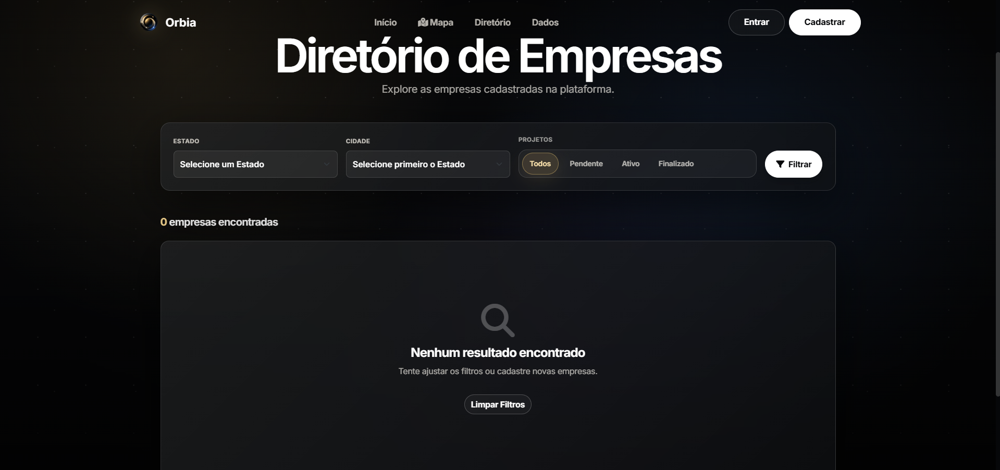
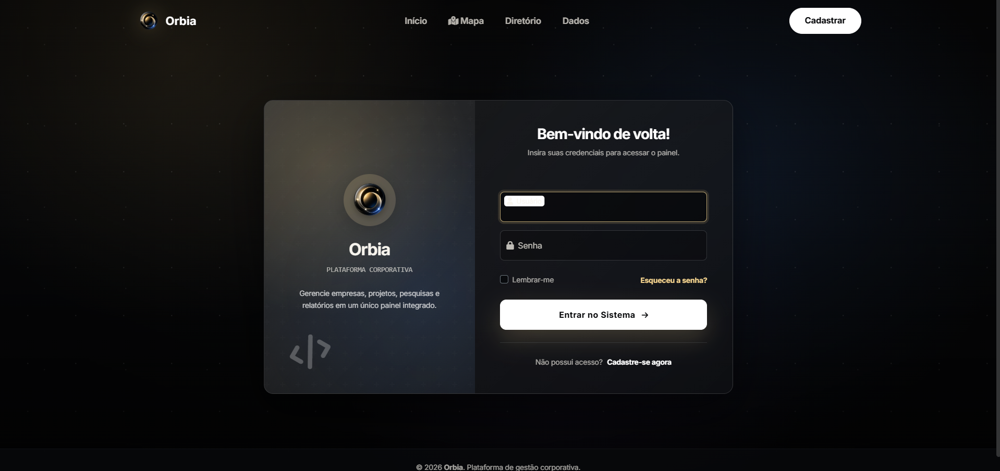
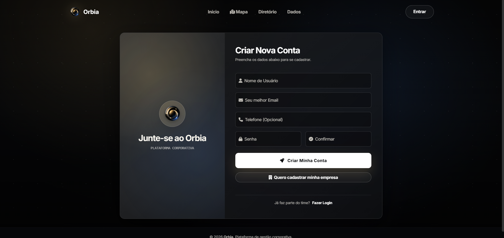

<div align="center">

# Orbia

> 🚧 **Repositório demo** — versão pública refatorada para portfólio, baseada em sistema desenvolvido em equipe.
> O código completo de produção está em repositório privado.


</div>

> Plataforma corporativa para gestão de empresas, projetos, pesquisas e relatórios — em um único fluxo.

---

## O Problema

Organizações que gerenciam redes de empresas parceiras e representantes regionais não têm uma ferramenta centralizada para cadastrar entidades, mapear sua distribuição geográfica, acompanhar projetos por status e coletar pesquisas anuais — tudo com controle de acesso por tipo de usuário.

**Orbia resolve isso em um único painel:** cadastro geolocalizado de empresas → gestão de projetos vinculados → pesquisas estruturadas → dashboards e exportação de relatórios.

---

## 📖 Descrição

**Orbia** é uma plataforma web full-stack desenvolvida em Django 5 que centraliza a operação de uma organização: cadastro e geolocalização de empresas, gestão de projetos por status, pesquisas estruturadas com histórico, dashboards com métricas em tempo real, mapas interativos e exportação para CSV/PDF.

A interface adota uma estética **dark moderna** com efeitos de glassmorphism, gradientes e tipografia Inter, oferecendo uma experiência polida tanto em desktop quanto em dispositivos móveis.

---

## 🪪 Contexto e Autoria

Este projeto é uma versão própria, refatorada e adaptada para portfólio, baseada em um sistema acadêmico desenvolvido em equipe durante o curso. No projeto original, atuei como principal responsável por toda a camada de frontend, incluindo identidade visual, templates Django, landing page, dashboard, formulários, telas de autenticação, páginas públicas e experiência do usuário. Além disso, contribuí diretamente em funcionalidades de backend: autenticação, recuperação de senha, upload de mídia, rotas, seeders, estatísticas dinâmicas, filtros avançados, integração com Chart.js, geolocalização com geopy, mapas interativos com Leaflet.js e controle de acesso.

- **Autor (portfólio):** Matheus Beiruth — [@BeiruthDEV](https://github.com/BeiruthDEV)
- **Repositório:** https://github.com/BeiruthDEV/Orbia
- **Projeto original (em equipe):** https://github.com/JoaoLopes07/projeto-integrador-curso

---

## ✨ Funcionalidades

- 🔐 **Autenticação completa** — login, registro, recuperação de senha por e-mail, logout, alteração de senha
- 🌐 **Login social** — Google e GitHub via `django-allauth`
- 👥 **Controle de acesso por papéis** — Diretoria, Associado, Afiliado (cada papel com permissões e dashboards próprios)
- 🏢 **Gestão de empresas** — cadastro com CNPJ, razão social, área de atuação, contato, redes sociais e endereço completo
- 🗺️ **Geolocalização automática** — geocoding via `geopy` + Nominatim ao salvar a empresa
- 📍 **Mapa interativo** — `Leaflet.js` com pinos por empresa, popups com link para o site
- 📊 **Dashboards** — métricas consolidadas, gráficos `Chart.js` (top cidades, status de projetos, distribuição por estado)
- 📋 **Gestão de projetos** — CRUD vinculado à empresa, status (Planejamento / Em Desenvolvimento / Finalizado)
- 📝 **Pesquisas anuais** — formulário público, histórico, controle de submissão única, relatórios públicos
- 🔎 **Filtros avançados** — busca por estado, cidade (carregamento dinâmico), status no diretório público
- 📤 **Exportação** — CSV e PDF (via `xhtml2pdf`) para empresas e projetos
- 📷 **Upload de avatar de usuário** — armazenado em `/media`
- 📱 **UI responsiva** — Bootstrap 5 + estética dark com glassmorphism
- 🛡️ **Hardening básico** — `whitenoise` para estáticos em produção, `CompressedManifestStaticFilesStorage`, secrets via env

---

## 🧰 Tech Stack

| Camada            | Ferramenta                                                  |
|-------------------|-------------------------------------------------------------|
| Backend           | Python 3.11+, Django 5.2                                    |
| Auth              | `django-allauth` (Google + GitHub), `djangorestframework_simplejwt` |
| Forms             | `django-crispy-forms` + `crispy-bootstrap5`                 |
| Banco (dev)       | SQLite                                                      |
| Banco (prod)      | PostgreSQL via `dj-database-url` + `psycopg`                |
| Estáticos         | `whitenoise`                                                |
| PDF               | `xhtml2pdf`                                                 |
| Imagens           | `Pillow`                                                    |
| Geocoding         | `geopy` (Nominatim/OpenStreetMap)                           |
| Frontend          | Bootstrap 5.3, Font Awesome 6, Inter (Google Fonts)         |
| Mapas             | `Leaflet.js` 1.9                                            |
| Gráficos          | `Chart.js` 4                                                |
| Servidor (prod)   | `gunicorn`                                                  |
| Config            | `python-dotenv`                                             |

---

## 📁 Estrutura de Pastas

```
orbia/
├── accounts/                   # Custom user, auth views, perfis, signals
├── companies/                  # Empresas + Representantes (geocoding no save)
├── projects/                   # CRUD de projetos vinculados à empresa
├── surveys/                    # Pesquisas, histórico, relatórios públicos
├── public/                     # Landing, mapa, diretório, estatísticas
├── core/                       # Permissions, utils, comandos (setup_roles, setup_social_login)
├── meuprojeto/                 # Settings, urls, wsgi, asgi do projeto Django
├── templates/                  # Templates HTML centralizados
│   ├── accounts/               # login, register, home, profile, change_password
│   ├── companies/              # company_list, company_form, company_public_register
│   ├── projects/               # project_list, project_detail, project_form
│   ├── surveys/                # survey_form, history, success, report
│   ├── public/                 # landing, mapa, diretório, estatísticas
│   ├── registration/           # password reset (4 telas)
│   ├── representante/          # CRUD de representantes
│   ├── dashboard/diretoria/    # painel administrativo
│   └── base.html               # layout raiz
├── static/                     # CSS + assets (style.css, orbia-icon.png)
├── media/                      # uploads de usuários (avatar etc.)
├── manage.py
```

---

## 🚀 Como rodar localmente

### 1. Clonar o repositório

```bash
git clone https://github.com/BeiruthDEV/Orbia.git
cd enterprise-flow
```

### 2. Criar e ativar ambiente virtual

**Windows (PowerShell)**
```powershell
python -m venv venv
venv\Scripts\Activate.ps1
```

**Linux / macOS**
```bash
python -m venv venv
source venv/bin/activate
```

### 3. Instalar dependências

```bash
pip install -r requirements.txt
```

### 4. Configurar variáveis de ambiente

```bash
cp .env.example .env       # Linux/macOS
copy .env.example .env     # Windows
```

Edite o `.env` e gere uma `SECRET_KEY` real:

```bash
python -c "from django.core.management.utils import get_random_secret_key; print(get_random_secret_key())"
```

### 5. Aplicar migrações e criar superusuário

```bash
python manage.py migrate
python manage.py createsuperuser
```

### 6. (Opcional) Configurar papéis e providers sociais

```bash
python manage.py setup_roles
python manage.py setup_social_login
```

### 7. Subir o servidor

```bash
python manage.py runserver
```

Acesse: <http://127.0.0.1:8000/>

---

## 🔐 Variáveis de Ambiente

Veja `.env.example` para a lista completa documentada. Resumo:

| Variável                   | Obrigatória | Descrição                                           |
|----------------------------|-------------|-----------------------------------------------------|
| `SECRET_KEY`               | ✅           | Chave criptográfica do Django                       |
| `DEBUG`                    | ✅           | `True` em dev, `False` em produção                  |
| `ALLOWED_HOSTS`            | ✅           | Hosts separados por vírgula                         |
| `DATABASE_URL`             | prod        | URL completa do Postgres (vazio = SQLite local)     |
| `SITE_ID`                  | —           | ID do site para `django.contrib.sites` (default: 1) |
| `EMAIL_HOST` / `EMAIL_PORT`| prod        | SMTP de envio de e-mails                            |
| `EMAIL_HOST_USER` / `_PASSWORD` | prod   | Credenciais SMTP                                    |
| `DEFAULT_FROM_EMAIL`       | prod        | Endereço remetente padrão                           |
| `EMAIL_TIMEOUT`            | —           | Timeout SMTP em segundos (default: 10)              |
| `RENDER_EXTERNAL_HOSTNAME` | auto        | Injetado pela Render — não setar manualmente        |

> ⚠️ Em desenvolvimento, **não defina `DATABASE_URL`**. O `settings.py` levanta `RuntimeError` se `DEBUG=True` e `DATABASE_URL` estiver presente, para evitar tocar produção sem querer.

---

## 🛠️ Comandos úteis

```bash
# Migrações
python manage.py makemigrations
python manage.py migrate

# Superusuário
python manage.py createsuperuser

# Setup inicial (papéis + login social)
python manage.py setup_roles
python manage.py setup_social_login

# Coletar estáticos para produção
python manage.py collectstatic --noinput

# Testes
python manage.py test
```

---

## 📸 Screenshots

### Landing page


### Mapa interativo


### Diretório público


### Login


### Cadastro


---

## 🗺️ Próximas Melhorias

- [ ] Suíte de testes mais ampla (cobrir views/permissions de cada app)
- [ ] API REST pública com `djangorestframework` (já instalado) + JWT
- [ ] Internacionalização — atualmente fixado em `pt-br`, expor `en`
- [ ] CI/CD: GitHub Actions com lint (`ruff`) + testes em PR
- [ ] Containerização — `Dockerfile` + `docker-compose.yml` para Postgres local
- [ ] Logging estruturado (substituir `print()` por `logging` em `companies/models.save`)
- [ ] Cache de geocoding para evitar chamadas repetidas ao Nominatim
- [ ] Acessibilidade (WAI-ARIA) — auditar formulários e contraste
- [ ] PWA — `manifest.json` + service worker para uso offline básico

---

## 📄 Licença

MIT — uso livre para fins de portfólio e estudo.

---

<div align="center">

**[BeiruthDEV](https://github.com/BeiruthDEV)** · [LinkedIn](https://www.linkedin.com/in/matheusbeiruth)

</div>
